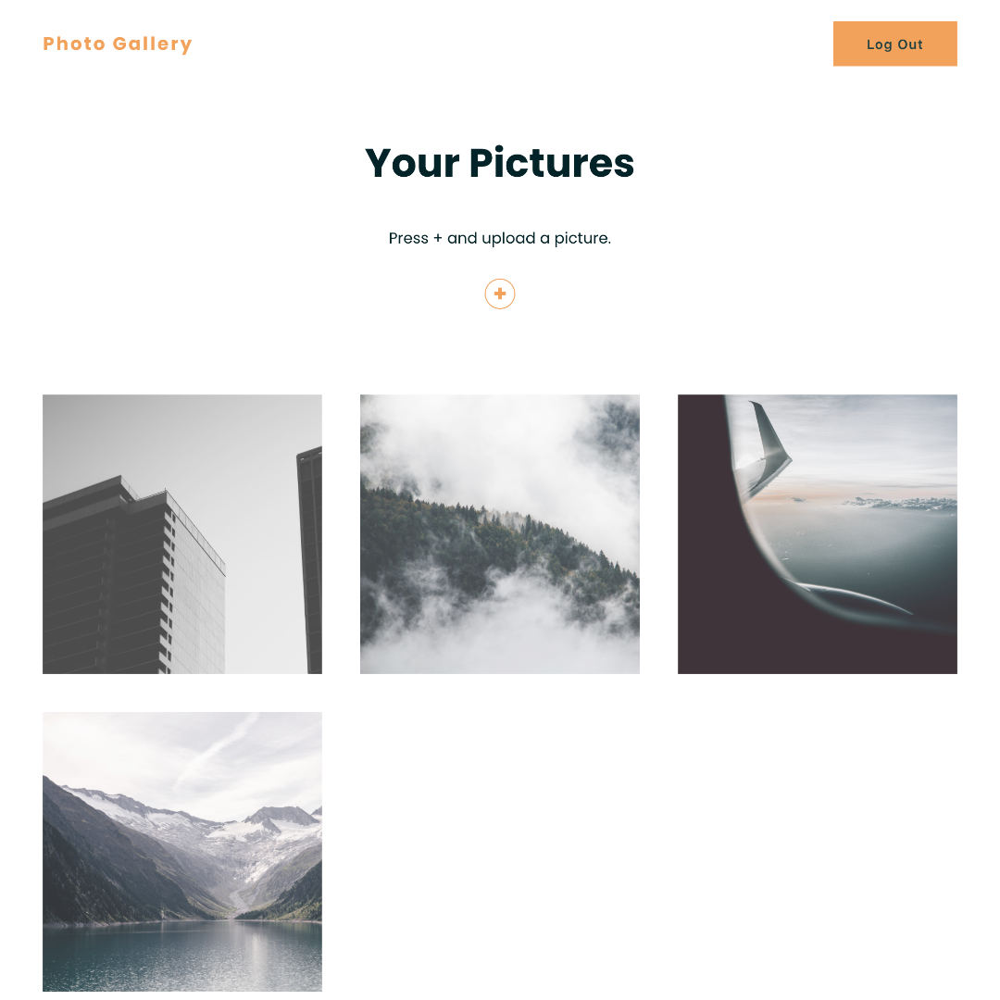
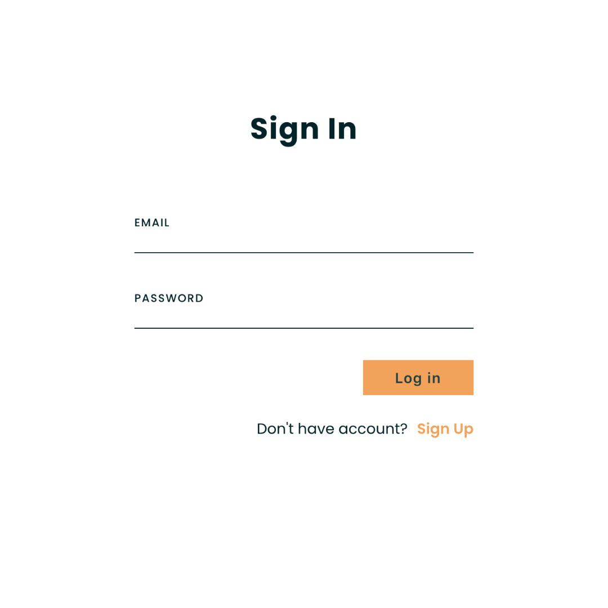
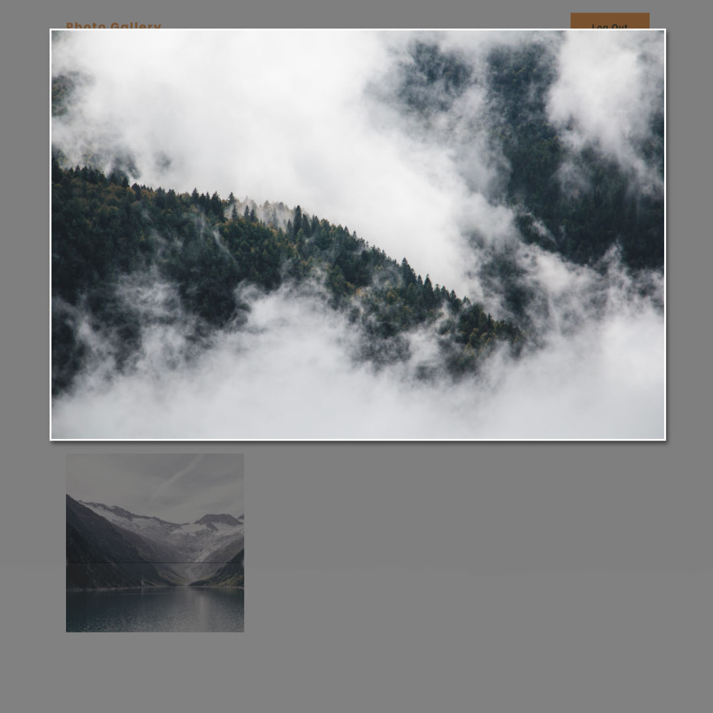

# PHOTO-GALLERY

## Available Scripts

### Install dependencies

```bash
npm install
```

### Run App

```bash
npm run dev
```

Runs the app in the development mode.<br />
Open [http://localhost:8080/](http://localhost:8080/) to view it in the browser.

The page will reload if you make edits.<br />
You will also see any lint errors in the console.

## Screenshots




